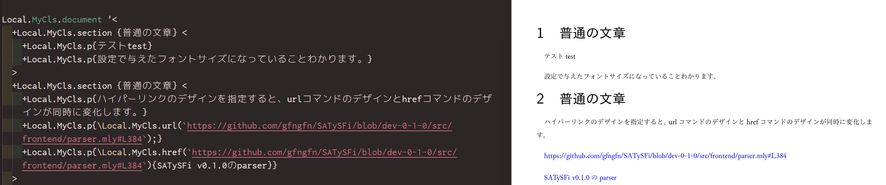

# Clsor class concept

「ドキュメントテンプレートのファンクタ」として作成している、SATySFiのドキュメントクラス生成ライブラリであるClsorである。

SATySFiのv0.1.0で導入される予定の機能に依存しているため、「実証実験段階」として公開している。

# demoファイルのビルド方法

依存ソフトウェアは

- [SATySFi](https://github.com/gfngfn/SATySFi)
- git
- make

である。


まず、SATySFiをインストール手順に従ってインストールする。その際、SATySFiで使用するフォントのインストールを**必ず**行う。

※わかる人向けの解説：
SATySFiを必ずインストールする必要はありませんが、SATySFiのREADMEに従ってインストールすることで、このリポジトリで行うSATySFi開発版のビルド環境を整えることができるため、インストールを推奨している。

次に、このリポジトリをcloneする。：

```
git clone https://github.com/puripuri2100/satysfi-class-clsor-concept.git
```

その後、cloneしたリポジトリのフォルダに移動してビルドを行う。

```
make demo
```

成功すればdemoフォルダ内にdemo.pdfファイルが生成される。

demo/local.satyhファイル内の設定を変更することで生成されるドキュメントの体裁を変更することができる。

# 制作目的

SATySFi v0.1.0で追加される予定のF-ing modulesでは、ファンクタを使用することができる。

ここでの「ファンクタ」とは「モジュールをモジュールに写す函数」であり、モナド等の文脈で出てくる用語とは無関係である[^1]。

ファンクタは「モジュール全体が持つ機能を抽象化する」という役割も持っていますが、今回は「設定を与えれば共通化されている函数が自動で生成される」という特徴に注目しました。
この性質は、多くの函数を提供し、異なるライブラリ間で共通のインターフェースを提供する必要があり、ある程度設定を使いまわすことのある種類のライブラリに対して使うことで、大きな利点を得ることができる。「組版用プログラミング言語」であるSATySFiで使用する上でこのような性質を持つライブラリとして、ドキュメントテンプレートである「ドキュメントクラス」が挙げられる。

「ドキュメントクラス作成用ライブラリ」はいくつか先行事例が存在し、その例としてLaTeXでのjlreq[^2]、SATySFiでのsatysfi-class-jlreq[^3]が挙げられる。どちらも阿部紀行氏によって作成された、「日本語組版処理の要件の実装を試みる」クラスファイルである[^4]。


今回は、ファンクタを用いることで、これらの既存ライブラリと同じような役割を持つ、ドキュメントクラス作成用ライブラリを作成することを目指した。


[^1]: gfn，「F-ing modulesの型検査とコンパイル手法」，yabaitech.tokyo vol.5，2021年7月10日，56ページ．

[^2]: ABE Noriyuki，"abenori/jlreq"，閲覧日 2022-02-05，https://github.com/abenori/jlreq．

[^3]: ABE Noriyuki，"abenori/satysfi-class-jlreq"，閲覧日 2022-02-05，https://github.com/abenori/satysfi-class-jlreq

[^4]: ABE Noriyuki，"jlreq"，閲覧日 2022-02-05，https://www.tug.org/texlive//Contents/live/texmf-dist/doc/latex/jlreq/jlreq-ja.html

# 実装とその結果

設定を与える方法はいくつか考えられる。


```
module ClsSettings = struct
  val config1 = a
  val config2 = b
  val config3 = c
  ...
  val config26 = z
end
```

のように、単純に設定項目を増やす手法では

- 必要な設定項目が多くなり、手軽さが無くなる
- 設定項目に変更を加えると破壊的変更となる

というデメリットが存在する。


SATySFiのいくつかのライブラリではパイプライン演算子と設定用関数を用いる手法で、この設定方法のデメリットを回避している。

この手法を用いると

```
module ClsSettings = struct
  val config = Clsor.default
                |> set-config1 a
                |> set-config2 b
                |> set-config3 c
                ...
                |> set-config26 z
end
```

というように設定を記述することができる。

このような設定手法はSATySFiでは

- satysfi-easytable[^5]
- satysfi-derive[^6]
- satysfi-code-printer[^7]
- satysfi-figbox[^8]
- satysfi-karnaugh[^9]

などで採用されている。また、似たような手法での設定の記述では、Rustのアプリケーション引数解析ライブラリであるclap[^10]などでも採用されている。

SATySFiでのこのような設定の仕方をまとめて報告した発表が「SATySFiでDSLを作る/使うと便利って話」というタイトルでSATySFi Conf 2021で行われている。


今回作成したライブラリでは、この報告を参考にして、このような設定記述方法を採用した。

デフォルトの設定を生成する`default`函数の他、

- 本文用のフォントサイズを設定する`set-font-size-normal`函数
- リンク用コマンドのデザインを設定する`set-link-format`函数
- 節見出しのデザインを設定する`set-section-title-format`函数
- フォントを設定する`set-cjk-*`函数や`set-latin-*`函数

を今回定義した。


この函数を用いて


```
module MyClsSettings = struct
  val config = Clsor.default ()
                |> set-font-size-normal 10pt
                |> Clsor.set-link-format (fun it -> {\textcolor(Color.blue)(it);})
                |> set-cjk-mincho (`ipaexm`, 0.9, 0.0)
end

module MyCls = Clsor.Make MyClsSettings
```

のようにして設定することで、

- 本文用のフォントサイズが10pt
- リンクを貼るコマンドでは、テキストの色が青色になる
- 明朝体のフォントはipaexmというフォントで、大きさが0.9倍に補正され、上下位置の補正は無し
- その他の設定はデフォルト通り

という設定で各種コマンドや函数が提供されるドキュメントクラスモジュールが自動生成されるようになっている。

例えば、`Clsor.set-link-format`によって設定された項目は、

- テキストにハイパーリンクを埋め込む`\href`コマンド
- URLを入力するとURL先がハイパーリンクとして埋め込まれたURLテキストが出力される`\url`コマンド

の二つのコマンドの挙動に影響し、先ほどの例では次の図のようになる（左がSATySFiドキュメントの記述で、右が出力結果のPDF）：




詳しい挙動はこのリポジトリ内のdemo文書をコンパイルすることで確認して欲しい。


この実装したライブラリでは、目的である「ファンクタを用いたドキュメントクラス作成用ライブラリの作成」を実現した。


ファンクタを用いることによるメリットとして

- モジュールを切り替えるだけで、文書の記述を一切変更することなく文書の体裁を変更することができる

というものを確認した。デメリットとして

- 生成されるドキュメントクラス用から提供される函数・コマンドの挙動に依存するようなドキュメントクラス用の設定が記述できない

というものを確認した。今後はこれを克服する手法を考案したい。

なお、実装した機能は文書を作成するために必要な最低限の機能のみの提供となっており、機能拡充は今後の課題としたい。


[^5]: Shinichi Mogami，"monaqa/satysfi-easytable: A SATySFi package to build simple tables."，閲覧日 2022-02-05，https://github.com/monaqa/satysfi-easytable

[^6]: Yuito Murase，"yabaitechtokyo/satysfi-derive: SATySFi commands and DSL for displaying derivation trees with maintainable code"，閲覧日 2022-02-05，https://github.com/yabaitechtokyo/satysfi-derive

[^7]: Naoki Kaneko，"puripuri2100/satysfi-code-printer: Typeset source code with SATySFi"，閲覧日 2022-02-05，https://github.com/puripuri2100/satysfi-code-printer

[^8]: Shinichi Mogami，"monaqa/satysfi-figbox: A SATySFi package that creates charts and places them in inappropriate positions."，閲覧日 2022-02-05，https://github.com/monaqa/satysfi-figbox

[^9]: takagiy，"takagiy/satysfi-karnaugh: Drawing Karnaugh maps in SATySFi / SATySFiでカルノー図を描くためのパッケージ"，閲覧日 2022-02-05，https://github.com/takagiy/satysfi-karnaugh

[^10]: clap-rs，"clap-rs/clap: A full featured, fast Command Line Argument Parser for Rust"，閲覧日 2022-02-05，https://github.com/clap-rs/clap

[^11]: Yuito Murase，"SATySFi Conf 2021 : SATySFi で DSLを作る/使うと便利って話"，閲覧日 2022-02-05，https://docs.google.com/presentation/d/1CmP_OdwNTNx46M0mqlK_EyO123BOGQNMTb25SwFhVnI/edit#slide=id.p

# ライセンス

SATySFiフォルダ内のライセンスは、そのフォルダ内にあるLICENSEファイルの記述に従う。

それ以外のフォルダ・ファイルのライセンスはMITライセンスのもとで公開・配布する。

---

(c) 2022 Naoki Kaneko (a.k.a. "puripuri2100")
